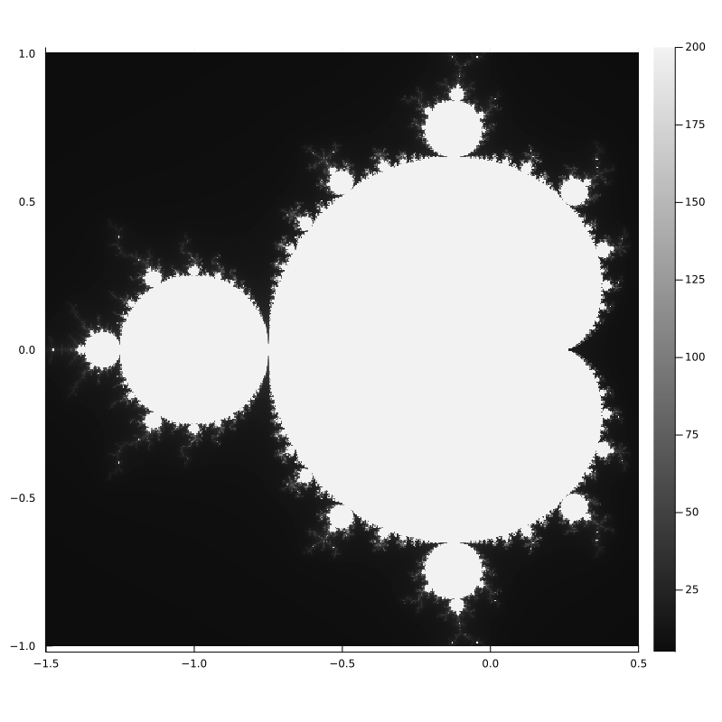
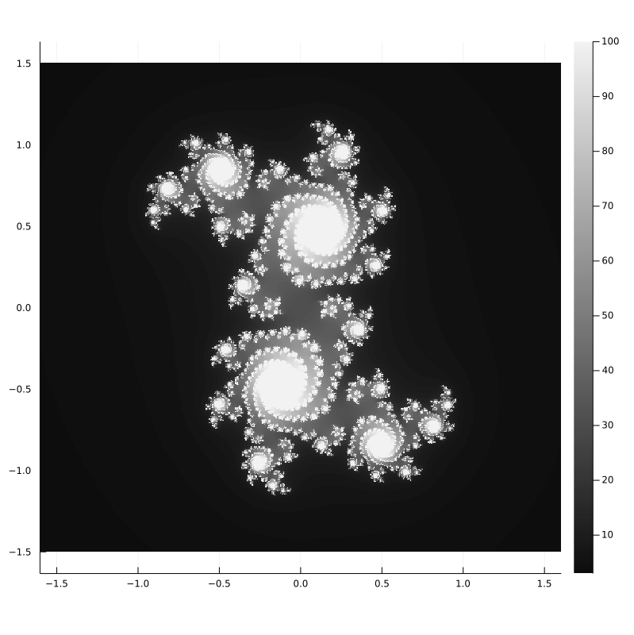
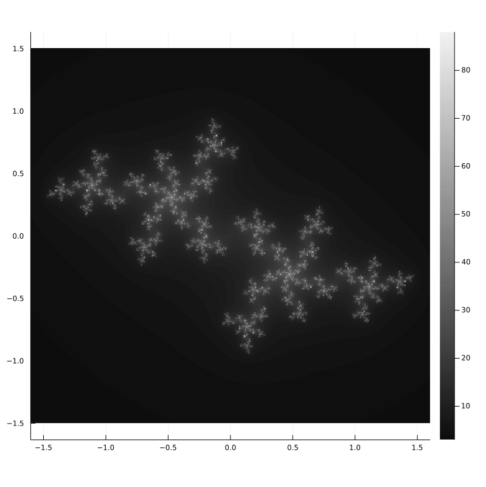

# Mandelbrot and Julia Set
These sets can be plotted in the complex plane and I just wanted to program that and learn how to use the Jupyter Notebook. The programming language is Julia btw. The Julia Set programmed in Julia... how funny, I know.

You can click on the .ipynb and then in the URL replace ".com" with ".dev". A version of VS Code should opens up and you can play around with the code. I hope...

# Examples
## Mandelbrot Set
You have probably seen the Mandelbrot Set. In the code you can set the real and imaginary limits and also the resolution.

## Julia Set
There are infinitely many Julia Sets and it depends on what function you choose. I have two different examples of a Julia Set.

